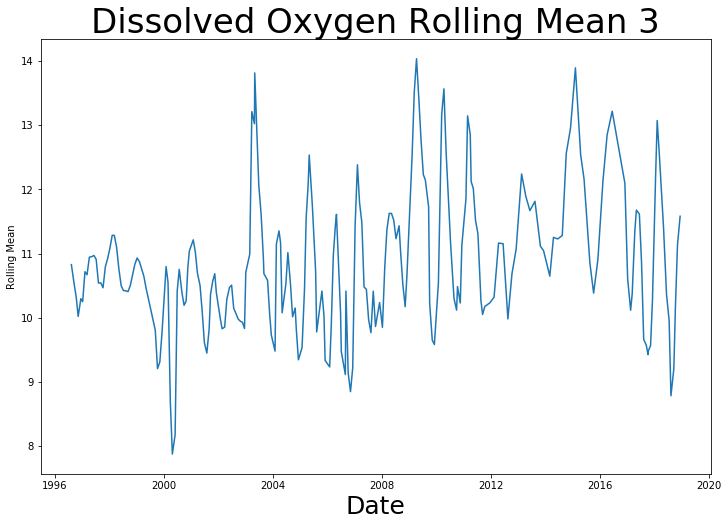
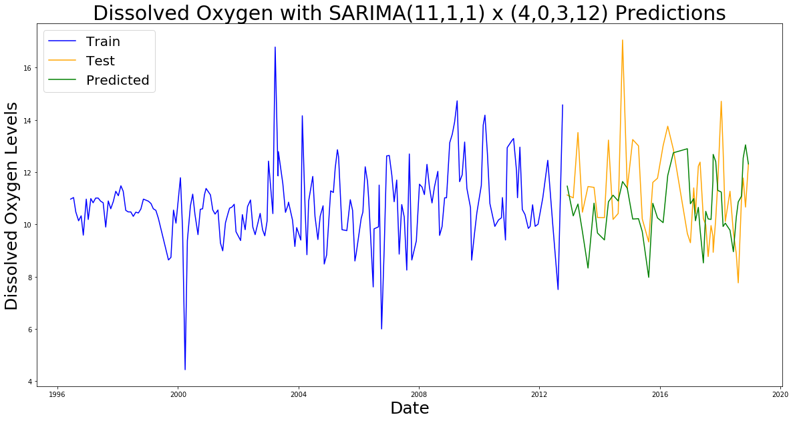

# Predicting Dissolved Oxygen Levels in Streams

## Problem statement
Dissolved Oxygen is a good indicator of stream health. Using tested levels of dissolved oxygen in a relatively healthy stream we can use TimeSeries Modeling to forecast future levels of dissolved oxygen. This can be used to flag changes in the health of the stream.

## Table of Contents:
[Original Data](./Data/cmcWaterQualitySamples.csv)  
[Modeled Data](./Data/DO_data.csv)  
[CMC Data Exploration](./Water_Quality_EDA.ipynb)  
[Creating Data for Modeling](./File_creation.py)  
[Exploring Sites](./Dissolved_Oxygen_Sites_exploration.ipynb)  
[Formulas for Modeling](./my_imports.py)  
[Modeling](./Dissolved_Oxygen_modeling.ipynb)

## What is Dissolved Oxygen and why does it matter?
Dissolved Oxygen is one of the most common measures of stream and water body quality. Fish and micro-organism require certain levels to maintain health numbers. A healthy range of dissolved oxygen is 8 mg/L to 15 mg/L. Above and below this is unhealthy for the ecosystem.

Low levels of dissolved oxygen is a large problem within the Chesapeake Watershed. Cyano bacteria consume the oxygen and create hypoxia (an environmental phenomenon where the concentration of dissolved oxygen in the water column decreases to a level that can no longer support living aquatic organisms[^1](https://gulfhypoxia.net/about-hypoxia/)) and eutrophic conditions (when a body of water becomes overly enriched with minerals and nutrients which induce excessive growth of plants and algae[^2](https://www.nature.com/scitable/knowledge/library/eutrophication-causes-consequences-and-controls-in-aquatic-102364466)). This has led to fish kills within the bay.

By monitoring levels at the subwatershed level we can try to stop issues at the source.

## Description of data
The data used for analysis was collected from 13 sites along the LeTort Spring Run by the [Letort Regional Authority](http://www.letort.org/) monthly from June 8th 1996 to December 10th 2018. Each site was aggregated together with the average of all the sites. There were 233 data points.

**Source:** [Chesapeake Monitoring Cooperative](https://www.chesapeakemonitoringcoop.org/) works with diverse partners to collect and share new and existing water quality data. Original data set was 10703 rows with 208 columns from 24 organizations. The LeTort Regional Authority had the most extensive collection data so was used for modeling.

|Feature|Type|Dataset|Description|                     
|---|---|---|---|
|Date|DatetimeIndex|agg_data.csv|Date of collection from 1996-06-08 to 2018-12-10
|dissolved_oxygen|float64|agg_data.csv|Averaged Dissolved Oxegen from 10 sites measure in mg/L

## Exploratory Data Analysis  

The Letort dataset contained data from 1992 to 2018. When I plotted the data I noticed a gap in the early nineties.

Timeseries analysis is thrown off by gaps in the data so I decided to start my analysis in 1996 where there is monthly collection until 2018.

### Time Series EDA

When reviewing the rolling mean we can see that there is a slight upward tilt to the data but it is pretty stationary.

#### Dickey Fuller
The Augmented Dicky is a unit root test that checks your data for stationarity. It uses autoregression to check how much the data is defined by a trend. Doing a Augmented Dickey-Fuller test on the data without adding any lags yielded a p-value of **8.057773505476658e-20**. Since this is well below 0.05 we can say with 95% confidence that the can reject the null hypothesis. The data is stationary and does not have a unit root.

#### Auto Coorelation and Partial Auto Correlation

Using Auto Correlation and Partial Auto Correlation plots we can get a sense of what the we should use for variables in our model. We can see a drop off after the second lag from which we can infer a q of 2 or 1. In the partial auto correlation plot we can see the a significant negative correlation at 4 and 8 from which we might infer a p of 4. But since this is seasonal data we can also see some movement surrounding multiples of three so we need to test 3 as well. We can also see a significance at 12 which indicates that there is seasonality to this data. This makes sense with dissolved oxygen.

## Modeling

Using the ACF and PACF plots I made some assumptions of the potential variables for p, d, q, P, D, Q and S and then tested different values to see how they worked together.

|p|d|q|P|D|Q|S|Mean Absolute Value|                     
|---|---|---|---|---|---|---|---|
3|1|2|4|0|3|12|1.224938
4|1|2|4|0|3|12|1.229332
4|1|1|4|0|3|12|1.233564
3|1|1|4|0|3|12|1.237515
8|1|2|4|0|3|12|1.245316
4|0|2|3|0|5|12|1.245989
3|0|0|2|0|3|12|1.251763

The average dissolved oxygen level in the test data is 10.73 mg/L. My best model is predicting with a mean absolute of 1.22 mg/L.

## Primary findings

#### Forecasted Data

|Month|Predicted Mean|                  
|---|---|
January|12.657800|
February|12.391092
March|12.118088
April|11.025860
May|10.793230
June|10.279456
July|10.434176
August|10.083808
September|11.292642
October|11.644566
November|11.289843
December|11.044667

Since we know that the stream is relatively stationary we are able to use these forecasted levels for the year 2019 to keep an eye on the health of the stream.

## Next Steps

1. Look at each location individually
2. More research into why the data is flatter before 2000
3. Look at why the levels at MG1, MG2 and WL are more variable than the LT sites.
4. Compare analysis to other stream data to see how health compares.
5. Normalize the testing, test every 30 days, test at same time.
6. Increase testing frequency so spikes in levels can be addressed faster.
